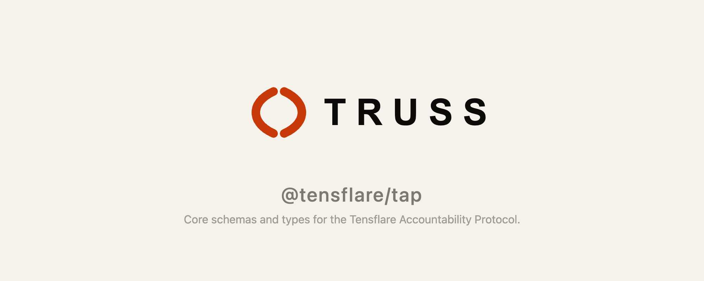

# @tensflare/tap

**Tensflare Accountability Protocol — shared Zod schemas and TypeScript types underpinning the entire Truss ecosystem.**

[](https://www.npmjs.com/package/@tensflare/tap)
[](LICENSE)
[](https://github.com/tensflare/truss-tap/actions)

---

## What is Truss?

Truss is an **accountability layer for AI agents** — it records every agent action as a cryptographically signed, tamper-evident audit trail. Mandates define what an agent is allowed to do; actions record what it actually did; delegations chain authority across agents and organizations. [Learn more →](https://truss.tensflare.com/docs)

## What is TAP?

TAP (Tensflare Accountability Protocol) is the **data-model foundation** for the entire Truss ecosystem. It exports runtime-validated Zod schemas and their derived TypeScript types. Every Truss package — SDKs, middleware, servers — builds on these schemas.

You can use TAP standalone in any Node.js project to validate mandate payloads, build custom compliance tooling, or extend the protocol.

## Schemas

| Schema | Description |
|---|---|
| `MandateSchema` | A signed delegation of authority from an issuing principal to an agent, defining scope, validity, and jurisdictional context. |
| `ActionRecordSchema` | A cryptographically linked record of an action taken under a mandate, forming an auditable chain of custody. |
| `DelegationHopSchema` | A single step in a delegation chain, including scope reduction, nonce, expiry, and jurisdiction evaluation. |
| `JurisdictionEvaluationSchema` | Results of evaluating which regulatory obligations apply to a mandate in a given jurisdiction. |
| `ScopeSchema` | Permitted actions, data types, and resource constraints. |
| `ValiditySchema` | Issued-at and expires-at timestamps with timezone support. |

All schemas provide both Zod runtime validation and inferred TypeScript types.

## Installation

```bash
npm install @tensflare/tap
```

## Quick start

```typescript
import { MandateSchema } from "@tensflare/tap";

const mandate = MandateSchema.parse({
  mandate_id: "mnd_001",
  agent_id: "agt_001",
  agent_name: "My Agent",
  issuing_principal: {
    entity: "org_1",
    human_id: "usr_1",
    role: "Admin",
  },
  scope: { permitted_actions: ["read", "write"] },
  jurisdiction_context: {
    deploying_org_jurisdiction: "US",
    operating_jurisdictions: ["US"],
  },
  validity: {
    issued_at: "2026-06-06T00:00:00Z",
    expires_at: "2026-12-31T23:59:59Z",
  },
});
```

## Related packages

| Package | Description |
|---|---|
| [@tensflare/truss-sdk](https://github.com/tensflare/truss-sdk-js) | TypeScript SDK with Ed25519 signing and API client |
| [@tensflare/cli](https://github.com/tensflare/truss-cli) | Command-line interface for the Truss API |
| [@tensflare/mcp](https://github.com/tensflare/truss-mcp) | MCP server for cross-org evidence coordination |

## Development

```bash
npm install
npm run build
npm test
```

## Contributing

Pull requests are welcome. Please open an issue first to discuss significant changes. This project is part of the [Tensflare](https://tensflare.com) ecosystem and follows its [contribution guidelines](https://truss.tensflare.com/docs/contributing).

## License

Apache 2.0 — see [LICENSE](LICENSE).
